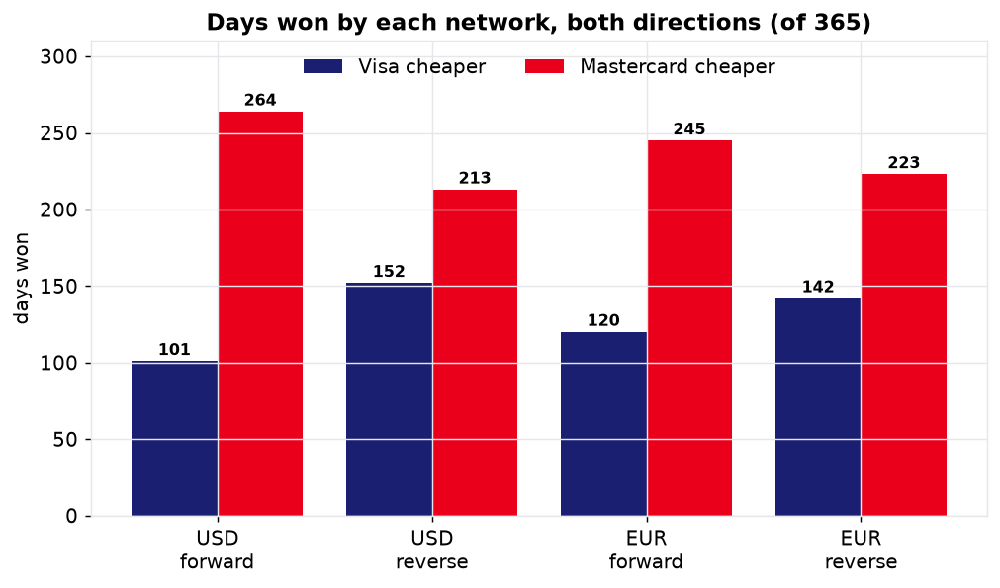
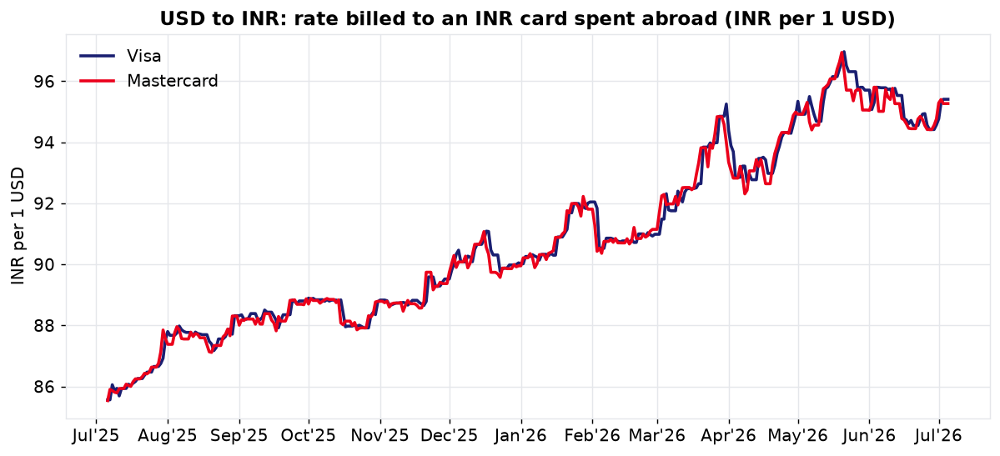
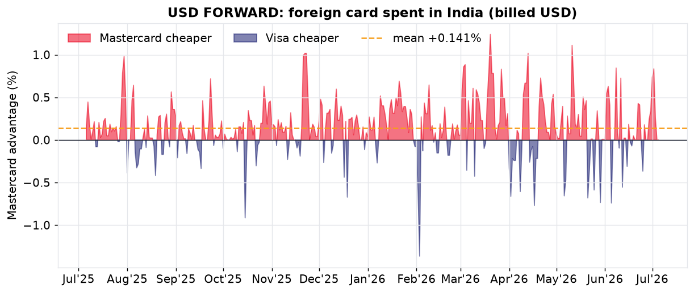
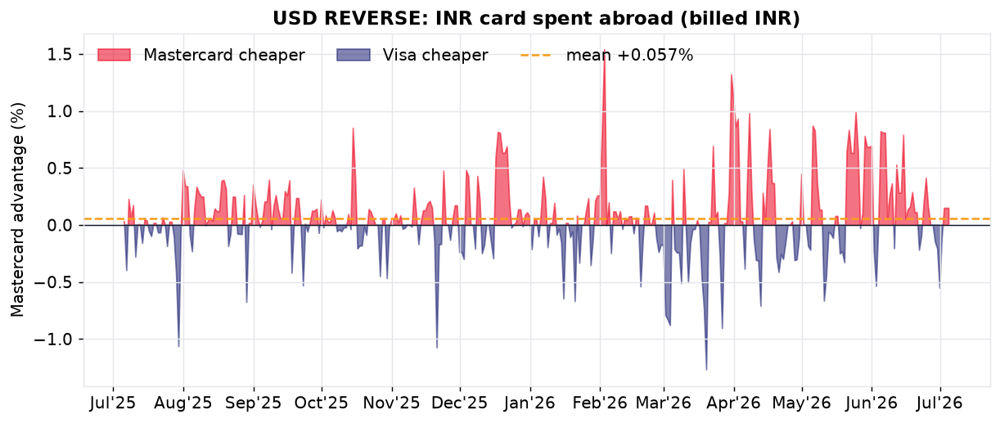
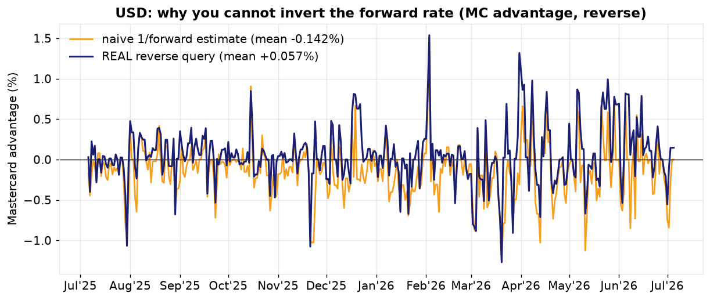

# Best Rates: Visa vs Mastercard Currency Conversion

A small project to see **which card network gives you better currency
conversion rates before your next international trip**.

Every time you swipe an international card, the **card network** (Visa or
Mastercard), not your bank, sets the base exchange rate that converts the
foreign amount into your billing currency. Visa and Mastercard publish these
daily rates, but they are buried inside on-page calculators and are only kept
for the trailing ~365 days. This project tracks those rates every day for a
full year, does a proper exploratory data analysis (EDA), and gives you a small
CLI to check who is cheaper this week, month, or year.

The tooling is **currency-agnostic**: point it at any currency pair the Visa
and Mastercard calculators support (USD, EUR, GBP, AED, JPY, and so on).

### The example in this repo

As a worked example I focus on my own use case, an **Indian cardholder (INR
card) spending abroad in USD and EUR**, i.e. someone based in India travelling
to the US or the Eurozone:

> If I spend in **USD** or **EUR** abroad on an **INR** card, whose rate is
> better, Visa or Mastercard, and by how much?

**TL;DR: when you query the network in the direction that actually matters
(spend foreign, get billed in INR), Mastercard gives the cheaper rate slightly
more often, on ~58-61% of days, by ~0.06% on average. It is close to a coin
flip, but Mastercard has the small edge.**

> **Important correction (see [Reverse-direction check](#the-direction-trap-why-you-must-query-the-real-direction)).**
> An earlier version of this analysis concluded "Visa wins" by *inverting* the
> forward rate (`1 / rate`). That is wrong: each network charges a directional
> spread, so the real reverse rate is ~0.2-1.0% worse than the inverse. When
> measured directly in the reverse direction, the winner flips on ~1 day in 3,
> and Mastercard, not Visa, comes out ahead overall.

Swap the currencies in `collect.py` to run the same analysis for your own
country and trip.

---

## The headline numbers

There are two directions, and you must query each one directly (see the
[direction trap](#the-direction-trap-why-you-must-query-the-real-direction)).

**Direction that matters for an Indian traveller: spend USD/EUR abroad, billed
in INR (real reverse query, lower INR paid per unit = better):**

| Metric | USD/INR | EUR/INR |
| --- | --- | --- |
| Days **Mastercard** was cheaper | **213 / 365 (58%)** | **223 / 365 (61%)** |
| Days Visa was cheaper | 152 / 365 | 142 / 365 |
| Average Mastercard advantage | +0.058% | +0.069% |
| Range of daily gap | -1.25% to +1.56% | -1.25% to +1.99% |

**Other direction: a USD/EUR card spending in India, billed in foreign
(the forward calculator mode; fewer foreign units billed = better):**

| Metric | USD/INR | EUR/INR |
| --- | --- | --- |
| Days **Mastercard** was cheaper | **264 / 365 (72%)** | **245 / 365 (67%)** |
| Days Visa was cheaper | 101 / 365 | 120 / 365 |
| Average Mastercard advantage | +0.141% | +0.138% |
| Avg markup over ECB mid (Visa / MC) | 0.23% / 0.09% | 0.51% / 0.37% |

Data window: **2025-07-06 to 2026-07-05** (365 daily observations per pair,
per direction). **Mastercard is cheaper more often in both directions**, because
it consistently prices closer to the ECB interbank mid-rate.

### Concrete rupee impact (spend abroad, billed in INR, real reverse query)

| You spend abroad | Avg Visa bill | Avg Mastercard bill | Mastercard saves |
| --- | --- | --- | --- |
| $1,000 | Rs 90,871 | Rs 90,818 | **~Rs 53** on average |
| Euro 1,000 | Rs 1,06,272 | Rs 1,06,198 | **~Rs 74** on average |

The gap is tiny (a fraction of a percent) and swings both ways day to day, so in
practice it is close to a wash with a slight Mastercard lean. Both networks are
far cheaper than a typical bank forex markup of 2 to 3.5%: your bank's own markup
and forex fee dominate the total cost, not the network choice.

---

## Charts

Every chart uses the **real** data for its direction (nothing is inverted). "MC
advantage" = the percentage by which Mastercard is cheaper than Visa that day
(above 0 = Mastercard cheaper, below 0 = Visa cheaper).

### Who wins, both directions
Mastercard leads all four bars: forward and reverse, USD and EUR.



### USD rate billed to an INR card spent abroad
Visa and Mastercard track each other closely; the edge lives in the tiny daily
gap between the lines.



### USD forward: foreign USD card spent in India (billed USD)


### USD reverse: INR card spent abroad (billed INR)


### USD reverse reality check: why you cannot invert the forward rate
Orange = the naive `1/forward` estimate (what the old, wrong conclusion used);
navy = the **real** reverse query. The estimate sits a whole directional spread
below reality, so it wrongly predicts Visa as the reverse winner.



The EUR/INR equivalents are in [`charts/`](charts/): `EUR_01_rate.png`,
`EUR_02_forward_gap.png`, `EUR_03_reverse_gap.png`, `EUR_04_reverse_check.png`.

---

## The direction trap: why you must query the real direction

A card conversion looks like it should be symmetric, so it is tempting to take
the forward rate (spend INR, billed USD) and just invert it (`1 / rate`) to get
the reverse (spend USD, billed INR). **This is wrong, and I verified it against
live data.**

Each network applies a **directional spread** (a bid/ask), so the real reverse
rate is not `1 / forward`. I re-collected a full year in the real reverse
direction (`collect_reverse.py`, transaction in USD/EUR, billed in INR) and
compared:

- The real reverse rate is worse than the naive inverse by, on average,
  **+0.38% (Visa) / +0.18% (Mastercard) for USD**, and
  **+1.00% (Visa) / +0.79% (Mastercard) for EUR**.
- Because Visa's reverse spread is larger, its apparent forward "win" does
  **not** carry over. The predicted winner (inverted) disagrees with the real
  winner on **124/365 days (USD)** and **135/365 days (EUR)**, about 1 day in 3.

Concrete example, 2026-07-01, USD:

| Direction | Visa | Mastercard | Cheaper |
| --- | --- | --- | --- |
| Forward: spend 100,000 INR, billed USD | 1,058.03 USD | 1,050.25 USD | Mastercard |
| Reverse: spend 1,000 USD, billed INR | 94,765 INR | 95,290 INR | Visa |

On this particular day the winner genuinely flips between directions; the point
is that you cannot infer the reverse from the forward, you have to query it. And
across the whole year, the *counts* do not mirror: Mastercard leads in both.

Corrected conclusion after measuring both directions directly:

- **USD/EUR card spending in India (billed foreign):** Mastercard cheaper on
  264/365 (USD) and 245/365 (EUR) days.
- **INR card spending abroad (billed INR):** Mastercard cheaper on 213/365
  (USD) and 223/365 (EUR) days.

So **Mastercard is the better default in both directions** over this year, by a
small margin, because it prices closer to the interbank mid-rate. The earlier
"Visa wins for the traveller" claim was an artifact of inverting instead of
measuring, and has been retracted.

---

## How to use this repo

Requires [uv](https://docs.astral.sh/uv/). All scripts use
[`curl_cffi`](https://github.com/lexiforest/curl_cffi) with browser
impersonation, so they need **no cookies, no API keys, and no personal data**.

```bash
uv sync
```

### 1. Compare right now: this week / month / year

```bash
uv run compare.py                     # both pairs, all three windows
uv run compare.py --pair USD/INR      # one pair
uv run compare.py --window week       # one window (week | month | year)
```

Example output:

```
### USD/INR

  This week (last 7 days):
  Winner: Visa        |  Visa avg cheaper by 0.083%
    days won: Visa 4 vs Mastercard 3 (of 7)  [2026-06-29 -> 2026-07-05]

  This month (last 30 days):
  Winner: Mastercard  |  Visa avg pricier by 0.157%
    days won: Visa 9 vs Mastercard 21 (of 30)

  This year (last 365 days):
  Winner: Mastercard  |  Visa avg pricier by 0.058%
    days won: Visa 152 vs Mastercard 213 (of 365)
```

`compare.py` reads the **real reverse-direction** history in `rates_reverse.csv`
(spend foreign, billed INR), so "this week/month/year" is always relative to the
latest date in your data. Re-run `collect_reverse.py` to bring it up to date.

### 2. Refresh the data (fetch a fresh year)

```bash
uv run collect.py           # forward: transaction INR, billed foreign -> rates.csv
uv run collect_reverse.py   # reverse: transaction foreign, billed INR -> rates_reverse.csv
```

Each run is ~365 days x 2 pairs x 2 networks (~10 min). You need the reverse file
for `compare.py` and for the traveller verdict.

To track **different currencies** (this tool is currency-agnostic), edit the
`CURRENCIES` list near the top of `collect.py`, for example:

```python
CURRENCIES = ["USD", "EUR", "GBP", "AED"]   # any codes the calculators support
```

then re-run `collect.py`, `eda.py`, and `compare.py`. The base/home currency is
INR here; change `toCurr` / `transaction_currency` in `collect.py` to analyse a
different home currency.

### 3. Regenerate the EDA charts and stats

```bash
uv run eda.py             # all direction-correct charts + summary.json
```

### 4. Quick textual analysis

```bash
uv run analyze.py         # both directions head-to-head + directional spread
```

---

## Files

| File | What it does |
| --- | --- |
| `collect.py` | Forward fetch (transaction INR, billed foreign) -> `rates.csv`. |
| `collect_reverse.py` | Reverse fetch (transaction foreign, billed INR) -> `rates_reverse.csv`. This is the direction that matters for a traveller. |
| `compare.py` | CLI: who is cheaper this week / month / year, and by what %. Uses `rates_reverse.csv`. |
| `analyze.py` | Both directions head-to-head (win rates, gaps) plus the directional spread, from real data. |
| `eda.py` | All direction-correct charts in `charts/` and `summary.json`. |
| `rates.csv` | Forward dataset: one row per day per pair, both networks. |
| `rates_reverse.csv` | Reverse dataset: one row per day per pair, both networks. |
| `summary.json` | Key EDA statistics as JSON. |
| `charts/` | All generated PNG charts. |

### `rates.csv` columns

| Column | Meaning |
| --- | --- |
| `date` | Rate date (YYYY-MM-DD). |
| `pair` | `USD/INR` or `EUR/INR`. |
| `visa_fx_per_inr` / `mc_fx_per_inr` | Foreign currency per 1 INR (the raw network rate). |
| `visa_inr_per_unit` / `mc_inr_per_unit` | INR per 1 unit of foreign currency (what you pay abroad). |
| `visa_bill_amt` / `mc_bill_amt` | Foreign amount billed for a 100,000 INR transaction. |
| `visa_benchmark` | ECB mid-market rate for that date (from Visa's response). |
| `visa_markup` | Visa's markup over the ECB benchmark (as fraction). |

`rates_reverse.csv` mirrors this for the reverse direction with columns
`visa_inr_per_unit` / `mc_inr_per_unit` (INR per 1 foreign unit, queried
directly) and `visa_bill_inr` / `mc_bill_inr` (INR billed for 1,000 units).

---

## Data sources and method

- **Visa:** `https://www.visa.co.in/cmsapi/fx/rates` (the public
  [Visa exchange-rate calculator](https://www.visa.co.in/support/consumer/travel-support/exchange-rate-calculator.html)).
  Also returns the ECB benchmark and Visa's own markup.
- **Mastercard:** `https://www.mastercard.com/marketingservices/public/mccom-services/currency-conversions/conversion-rates`
  (the public
  [Mastercard currency converter](https://www.mastercard.com/in/en/personal/get-support/currency-exchange-rate-converter.html)).
- Both endpoints only serve the **trailing ~365 days**; older dates return
  `400 Bad Request`, so the analysable window is one year ending today.
- Requests use `curl_cffi` (`impersonate="chrome"`) to present a real browser
  TLS/HTTP fingerprint, which cleanly passes the Cloudflare (Visa) and Akamai
  (Mastercard) bot protections without any cookies or credentials.

## Caveats

- These are **network base rates**. Your final cost also includes your issuing
  bank's markup and any forex/markup fee, which this project does not model.
- **Direction is not symmetric.** Each network charges a directional spread, so
  never infer the reverse rate by inverting the forward one; query the direction
  you actually use (that is why there are separate forward and reverse datasets).
- The margin between the two networks is small (well under 0.2% on a typical
  day) and swings both ways, so for a single trip the choice barely moves the
  needle. Over many transactions Mastercard has the slight, consistent edge.
- The ECB "markup" column is timing-noisy (the benchmark fixing and the network
  rate are not stamped at the same instant), so the headline verdict is based on
  the direct network-vs-network comparison, which is apples-to-apples.
- Rates on weekends/holidays carry over the last business-day value.

## Disclaimer

This project is **not affiliated with, endorsed by, or connected to Visa or
Mastercard** in any way. "Visa" and "Mastercard" are trademarks of their
respective owners. It only reads the same public rate calculators anyone can
open in a browser. Please **use it responsibly**: keep request volumes modest,
respect each site's terms of use, and treat the output as informational only,
not financial advice.

## License

Licensed under the **GNU General Public License v3.0** (GPLv3). See
[`LICENSE`](LICENSE). For informational purposes only; not financial advice.
