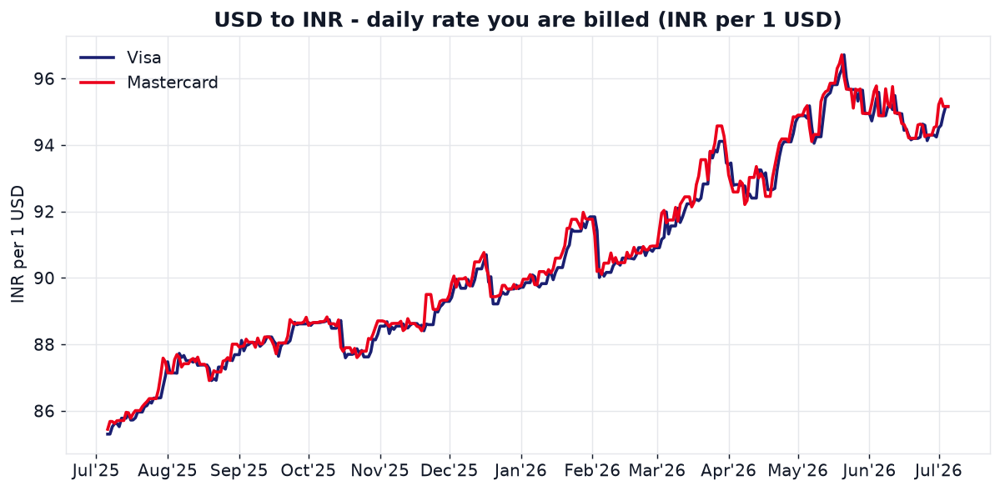
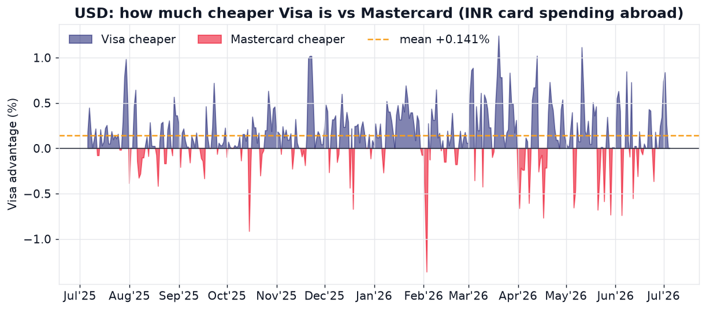
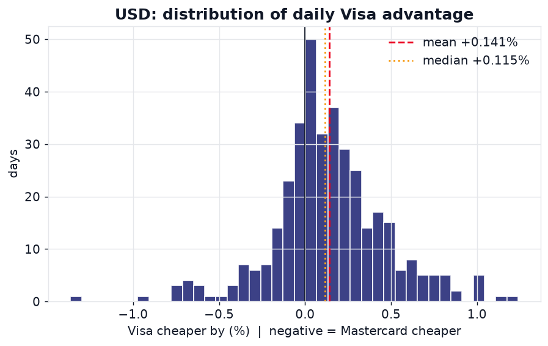
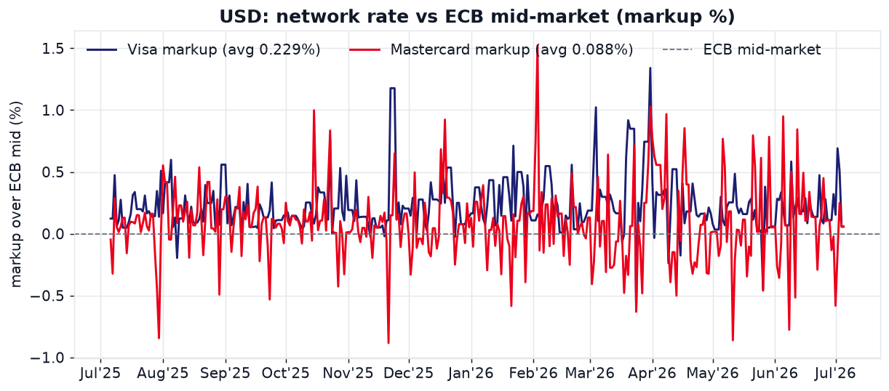
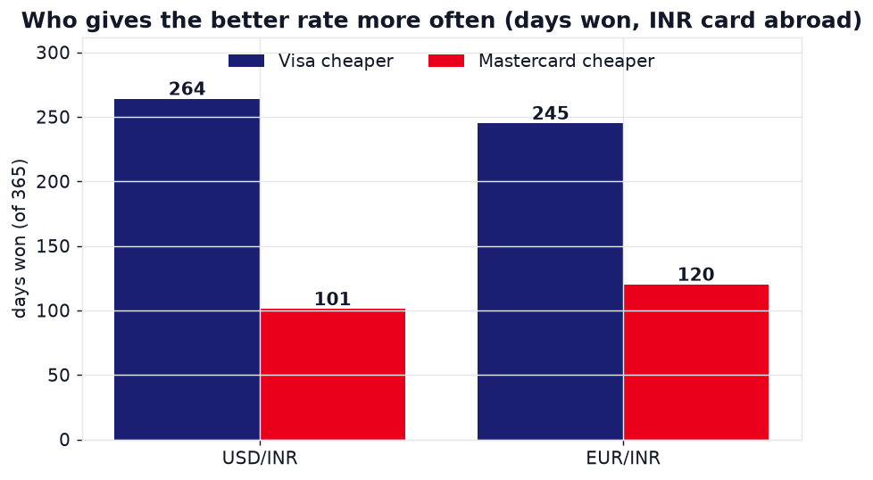
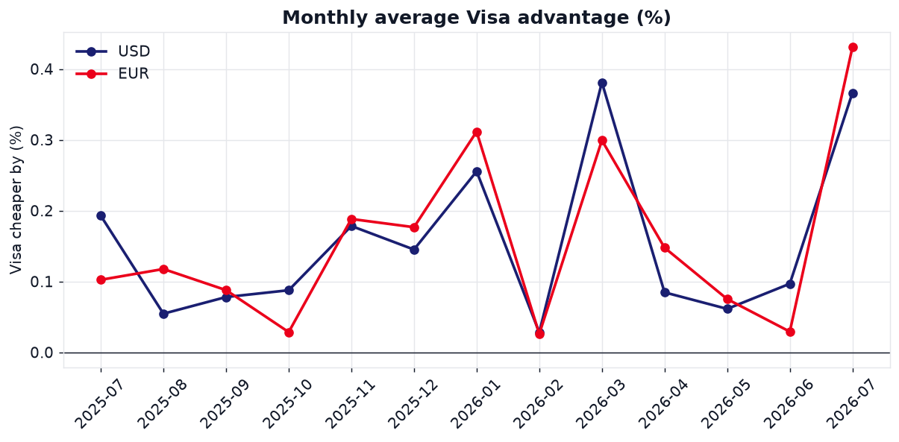

# Best Rates: Visa vs Mastercard on INR Card Spends

Every time you swipe an international card, the **card network** (Visa or
Mastercard), not your bank, sets the base exchange rate that converts the
foreign amount into your billing currency. Visa and Mastercard publish these
daily rates, but they are buried inside on-page calculators and they are only
kept for the trailing ~365 days.

This project **tracks those rates every day for a full year**, does a proper
exploratory data analysis (EDA), and answers one practical question for an
Indian cardholder:

> If I spend in **USD** or **EUR** abroad on an **INR** card, whose rate is
> better, Visa or Mastercard, and by how much?

**TL;DR: over the last 365 days, Visa gave the better rate on ~2 of every 3
days for both USD and EUR, by ~0.14% on average (up to ~1.8% on the best day).
For an Indian INR card spent abroad, Visa wins.**

---

## The headline numbers

| Metric (INR card spending abroad) | USD/INR | EUR/INR |
| --- | --- | --- |
| Days Visa was cheaper | **264 / 365 (72%)** | **245 / 365 (67%)** |
| Days Mastercard was cheaper | 101 / 365 | 120 / 365 |
| Average Visa advantage | **+0.141%** | **+0.138%** |
| Median Visa advantage | +0.115% | +0.104% |
| Best single day for Visa | +1.24% (2026-03-20) | +1.83% (2026-03-20) |
| Worst single day for Visa | -1.36% (2026-02-03) | -1.36% (2026-02-03) |
| Max absolute gap between networks | 1.35% | 1.86% |
| Avg markup over ECB mid (Visa) | 0.23% | 0.51% |
| Avg markup over ECB mid (Mastercard) | 0.09% | 0.37% |

Data window: **2025-07-06 to 2026-07-05** (365 daily observations per pair).

### Concrete rupee impact

| You spend abroad | Avg Visa bill | Avg Mastercard bill | You save with Visa |
| --- | --- | --- | --- |
| $1,000 | Rs 90,523 | Rs 90,651 | **~Rs 128** (up to Rs 1,159) |
| Euro 1,000 | Rs 1,05,220 | Rs 1,05,367 | **~Rs 147** (up to Rs 1,972) |

The gap is small on an average day but real, and both networks are far cheaper
than a typical bank forex markup of 2 to 3.5%. Your bank's own markup and forex
fee still dominate the total cost; the network is the smaller lever.

---

## Charts

### USD/INR rate over the year
Visa and Mastercard track each other closely; the difference lives in the tiny
daily gap between the two lines.



### How much cheaper Visa is (USD)
Blue = Visa cheaper, red = Mastercard cheaper. Most of the mass sits above zero.



### Distribution of the daily advantage (USD)
The distribution is centred slightly right of zero: a persistent, small Visa
edge rather than a fluke.



### Markup over the ECB mid-market (USD)
Both networks price above the ECB mid; Mastercard usually sits closer to it,
which is why Mastercard actually wins the opposite direction (see below).



### Who wins more often


### Monthly average advantage


The EUR/INR equivalents are in [`charts/`](charts/):
`01_EUR_rates.png`, `02_EUR_gap.png`, `03_EUR_hist.png`, `04_EUR_markup.png`.

---

## The one subtlety that flips the answer

A currency conversion is zero-sum, so **direction matters**:

- **Indian INR card, spending USD/EUR abroad (billed in INR):** you want the
  network that charges *fewer rupees per dollar/euro*. **Visa wins** (264/365
  USD, 245/365 EUR). This is the case this project optimises for.
- **USD/EUR card, spending in India (billed in foreign currency):** the maths
  inverts and **Mastercard wins** by the same margin, because Mastercard sits
  closer to the ECB mid-market rate.

So "who is better" is not universal, it depends on which way you convert. For
the common Indian traveller/shopper scenario, the answer is **Visa**.

---

## How to use this repo

Requires [uv](https://docs.astral.sh/uv/). All scripts use
[`curl_cffi`](https://github.com/lexiforest/curl_cffi) with browser
impersonation, so they need **no cookies, no API keys, and no personal data**.

```bash
uv sync
```

### 1. Compare right now: this week / month / year

```bash
uv run compare.py                     # both pairs, all three windows
uv run compare.py --pair USD/INR      # one pair
uv run compare.py --window week       # one window (week | month | year)
```

Example output:

```
### USD/INR

  This week (last 7 days):
  Winner: Visa        |  Visa avg cheaper by 0.345%
    days won: Visa 7 vs Mastercard 0 (of 7)  [2026-06-29 -> 2026-07-05]

  This month (last 30 days):
  Winner: Visa        |  Visa avg cheaper by 0.130%
    days won: Visa 19 vs Mastercard 11 (of 30)

  This year (last 365 days):
  Winner: Visa        |  Visa avg cheaper by 0.141%
    days won: Visa 264 vs Mastercard 101 (of 365)
```

`compare.py` reads the tracked history in `rates.csv`, so "this week/month/year"
is always relative to the latest date in your data. Re-run `collect.py` to bring
it up to date.

### 2. Refresh the data (fetch a fresh year)

```bash
uv run collect.py     # ~365 days x 2 pairs x 2 networks -> rates.csv (~10 min)
```

### 3. Regenerate the EDA charts and stats

```bash
uv run eda.py         # writes charts/*.png and summary.json
```

### 4. Quick textual analysis

```bash
uv run analyze.py     # prints the full head-to-head breakdown to the terminal
```

---

## Files

| File | What it does |
| --- | --- |
| `collect.py` | Fetches daily Visa and Mastercard INR rates (USD, EUR) for the trailing year via curl_cffi and writes `rates.csv`. |
| `compare.py` | CLI: who is cheaper this week / month / year, and by what %. |
| `eda.py` | Generates all charts in `charts/` and a machine-readable `summary.json`. |
| `analyze.py` | Prints the full statistical head-to-head (win rates, gaps, markups). |
| `rates.csv` | The tracked dataset: one row per day per pair, both networks. |
| `summary.json` | Key EDA statistics as JSON. |
| `charts/` | All generated PNG charts. |

### `rates.csv` columns

| Column | Meaning |
| --- | --- |
| `date` | Rate date (YYYY-MM-DD). |
| `pair` | `USD/INR` or `EUR/INR`. |
| `visa_fx_per_inr` / `mc_fx_per_inr` | Foreign currency per 1 INR (the raw network rate). |
| `visa_inr_per_unit` / `mc_inr_per_unit` | INR per 1 unit of foreign currency (what you pay abroad). |
| `visa_bill_amt` / `mc_bill_amt` | Foreign amount billed for a 100,000 INR transaction. |
| `visa_benchmark` | ECB mid-market rate for that date (from Visa's response). |
| `visa_markup` | Visa's markup over the ECB benchmark (as fraction). |

---

## Data sources and method

- **Visa:** `https://www.visa.co.in/cmsapi/fx/rates` (the public
  [Visa exchange-rate calculator](https://www.visa.co.in/support/consumer/travel-support/exchange-rate-calculator.html)).
  Also returns the ECB benchmark and Visa's own markup.
- **Mastercard:** `https://www.mastercard.com/marketingservices/public/mccom-services/currency-conversions/conversion-rates`
  (the public
  [Mastercard currency converter](https://www.mastercard.com/in/en/personal/get-support/currency-exchange-rate-converter.html)).
- Both endpoints only serve the **trailing ~365 days**; older dates return
  `400 Bad Request`, so the analysable window is one year ending today.
- Requests use `curl_cffi` (`impersonate="chrome"`) to present a real browser
  TLS/HTTP fingerprint, which cleanly passes the Cloudflare (Visa) and Akamai
  (Mastercard) bot protections without any cookies or credentials.

## Caveats

- These are **network base rates**. Your final cost also includes your issuing
  bank's markup and any forex/markup fee, which this project does not model.
- The ECB "markup" column is timing-noisy (the benchmark fixing and the network
  rate are not stamped at the same instant), so the headline verdict is based on
  the direct network-vs-network comparison, which is apples-to-apples.
- Rates on weekends/holidays carry over the last business-day value.

## License

MIT. For informational purposes only; not financial advice.
